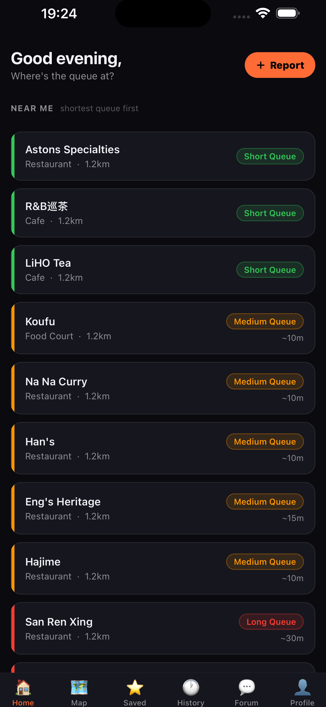
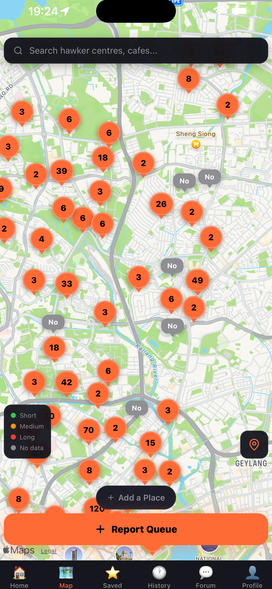
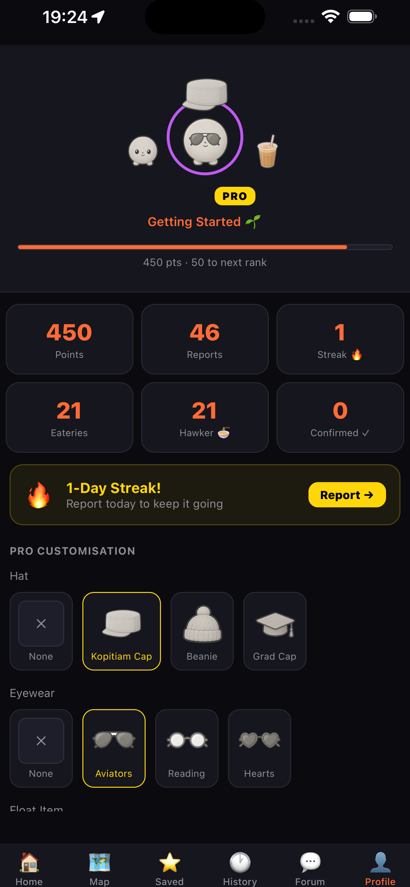

# QueueLah 🍜

**Live, crowd-sourced queue times for Singapore's hawker centres.**

Shipped solo to the iOS App Store — design, mobile app, database, auth, push notifications, Apple review, and marketing site.

[**📱 App Store**](https://apps.apple.com/sg/app/id6775145002) · [**🌐 queuelah.net**](https://queuelah.net)

`React Native 0.81` · `Expo 54` · `TypeScript` · `Supabase (Postgres · Auth · Realtime · Edge Functions · Storage)` · `Zustand`

<p align="left">
  
  
  
</p>

---

## What it does

QueueLah answers one question: **is this hawker centre worth heading to right now?**

> **Scope, honestly:** the app operates at *venue* level. Stall-level reporting is supported by the schema, the report flow and the UI, but the `stalls` table is only seeded for one venue — so "which stall should I join" is plumbed, not delivered.

Users report live queue lengths from a map of 200+ Singapore eateries. Reports expire after 30 minutes, so the map always reflects *now*. When no fresh report exists, the app falls back to a statistical busyness estimate rather than showing an empty map. Reporting earns points, daily streaks and badges, with a leaderboard and a community forum.

**Scale of the codebase:** ~10,400 lines of TypeScript across 17 screens, 27 ordered SQL migrations, 2 Supabase Edge Functions.

---

## Engineering decisions

The three problems below were the genuinely hard parts of this project. Each one changed how I build.

### 1. A crash that only existed in production

Apple rejected build 3: **blank screen on launch** — which I could not reproduce on any simulator or physical device.

**Root cause:** `.env` is gitignored (correctly). EAS Build also respects `.gitignore`, so the `EXPO_PUBLIC_*` variables were simply absent from the production bundle. `createClient(undefined, undefined)` then threw **at module import time** — before React rendered a single frame. Metro loads `.env` locally, so every development build worked perfectly. Sentry never reported it, because its DSN came from the same missing file.

**Fixes:**
1. Client-safe fallback constants in `app/lib/supabase.ts`, so absent env vars can never blank-screen the app again.
2. A separate `.env.eas` (gitignored, `EXPO_PUBLIC_*` only) pushed to EAS via `eas env:push`.
3. Verified the production build on a real device through TestFlight *before* resubmitting — approved same day.

**Takeaway:** anything that can throw at import time in a mobile bundle fails *before* your error boundary and *before* your crash reporter exists. Fail soft at module scope, and never trust a build you have only run through Metro.

### 2. Row-Level Security secures rows, not columns

A security audit of my own code found a **privilege escalation** in a policy that looked textbook-correct.

`user_profiles` used a standard ownership policy — `USING (auth.uid() = id)`. That is correct at the *row* level: a user can only touch their own row. But Postgres RLS does not restrict **columns**, and that same table held `is_admin`, `subscription_tier` and `points`.

So any signed-up user could ignore the app entirely and hit the REST API directly:

```bash
curl -X PATCH 'https://<project>.supabase.co/rest/v1/user_profiles?id=eq.<their-own-uid>' \
  -H "apikey: <public anon key>" \
  -H "Authorization: Bearer <their-own-jwt>" \
  -d '{"is_admin": true, "points": 999999}'
```

Admin grants update/delete on every venue plus full moderation powers. The anon key is public by design, so the only thing standing between any user and admin was a policy that never considered columns.

**Fix — column-level privileges, which RLS cannot express:**

```sql
REVOKE UPDATE ON public.user_profiles FROM authenticated;
GRANT  UPDATE (username, avatar_url, avatar_frame, username_color, push_token)
  ON public.user_profiles TO authenticated;
```

Hardening in the same pass:

| Issue | Fix |
|---|---|
| Report inserts used `WITH CHECK (true)` — anyone could post as any user | Tied `user_id` to `auth.uid()`; anonymous reports must leave it `NULL` |
| Points awarded client-side (read-compute-write, raceable) | Auth-guarded `SECURITY DEFINER` RPC with `SELECT … FOR UPDATE` row locking |
| Session tokens in plaintext `AsyncStorage` | Encrypted keychain via `expo-secure-store`, with a chunking adapter for values over its 2KB limit |
| No throttle on report inserts | `BEFORE INSERT` trigger — 5 reports / 60s per user or device |

**Takeaway:** "RLS is enabled" is not the same as "this table is secure." Any sensitive column living on a user-writable table needs column-level grants.

### 3. A crowd-sourced app with no crowd yet

The cold-start problem: a queue app with few users shows an empty map, and an empty map gives nobody a reason to open it tomorrow.

Rather than seed fake reports, [`app/lib/busyness.ts`](app/lib/busyness.ts) models expected busyness from first principles — per-venue-type weekly × hourly curves built from Gaussian bumps around known meal peaks, evaluated in fixed Singapore time (UTC+8) so output is independent of device timezone.

Three rules keep it honest:

- **A live report always wins.** Estimates only fill gaps where no report exists inside the 30-minute freshness window.
- **Estimates are visually distinct** — dashed map markers, a muted `EST` pill, a `~` prefix, and deliberately no minute figure.
- **Estimates never award points** and never touch the leaderboard. Only real reports do.

Pure functions with type-only imports, covered by 33 assertions in a dependency-free runner (`npx tsx app/lib/__tests__/busyness.test.ts`).

**The interesting tradeoff was product, not technical.** Showing modelled data risks eroding trust in the real data next to it. Separating the two visually — and never letting an estimate earn a reward — was what made it acceptable to ship.

---

## Architecture

```
React Native (Expo 54)
├── Zustand stores          auth · eateries · queue
├── React Navigation 7      stack + bottom tabs
└── Supabase JS client      keychain-backed session storage
        │
        ▼
Supabase
├── Postgres + RLS          27 migrations, column-level grants on sensitive tables
├── SECURITY DEFINER RPCs   atomic point/streak awards with row locking
├── Realtime                live map marker updates
├── Storage                 avatar photos, scoped to {uid}.jpg by policy
└── Edge Functions          delete-account (JWT-verified) · notify-confirmation (push)
```

**Security model in one line:** the app ships only publishable keys; every privileged operation is either an RLS-scoped table write, a column-level grant, or an auth-guarded `SECURITY DEFINER` function. The `service_role` key exists only in local scripts and Edge Function secrets, and has never been committed.

---

## Running it locally

```bash
npm install
cp .env.example .env      # fill in your own Supabase / Maps / analytics keys
npm start                 # or: npm run ios / npm run android
```

| Variable | Where to find it |
|---|---|
| `EXPO_PUBLIC_SUPABASE_URL` | Supabase → Settings → API → Project URL |
| `EXPO_PUBLIC_SUPABASE_ANON_KEY` | Supabase → Settings → API → anon/publishable key |
| `EXPO_PUBLIC_GOOGLE_MAPS_API_KEY` | Google Cloud Console → Maps SDK (restrict it to your bundle ID) |
| `EXPO_PUBLIC_POSTHOG_KEY` / `_HOST` | PostHog → Project Settings |
| `EXPO_PUBLIC_SENTRY_DSN` | Sentry → Client Keys (DSN) |
| `SUPABASE_SERVICE_KEY` | Supabase → Settings → API → `service_role` (**local seed scripts only — never bundled**) |

Then apply `supabase/migrations/` in order (001 → 027) via the Supabase SQL editor or `supabase db push`.

> Expo Go cannot load this project's native modules (AdMob, notifications, secure store). Use a development build:
> `eas build --profile development --platform ios`

**Edge Functions:** `supabase functions deploy delete-account notify-confirmation`

---

## Project structure

```
app/
├── components/     shared UI (ErrorBoundary, UserAvatar, EstimateBadge, …)
├── constants/      colours, config, ad unit IDs (test IDs auto-used in __DEV__)
├── hooks/          useAuth, usePremium, …
├── lib/            supabase client, secureStorage, busyness model, gamification,
│                   analytics, error reporting, avatar upload, content filter
├── screens/        17 screens, one file each
├── store/          Zustand: auth · eatery · queue
└── types/

supabase/
├── migrations/     27 ordered SQL migrations
├── functions/      delete-account · notify-confirmation
└── seeds/
```

---

## Retrospective

**What worked.** Shipping the whole thing solo, Apple review included. The security audit that caught the RLS column gap before anyone exploited it. The estimation model as a genuine answer to cold start.

**What I'd do differently.** The framing was "Waze for queues" — but Waze's flywheel is *passive*: it collects data simply by being open during a drive. Every QueueLah data point requires a deliberate tap from someone who has already finished queuing and gains nothing personally by reporting. The estimation model in §3 is a solid engineering answer to what was really a structural product problem. Next time I'd validate the data-collection loop *before* building the product around it.

**Status.** Live on the App Store and maintained as a portfolio project rather than a commercial one.

---

*Built by Damien Toh · Singapore*
